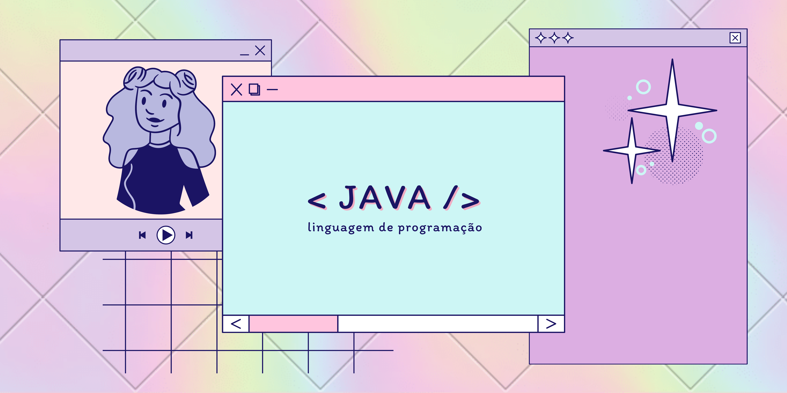

> 🖥️ Exercícios em Java

## ✏️ Sobre o repositorio

Estou deixando aqui 25 exercícios que concluí nas aulas de JAVA no instituto PROA.

---------------------------

Feito com :hearts: por <a href="https://github.com/yasxxv">yasxxv</a>
